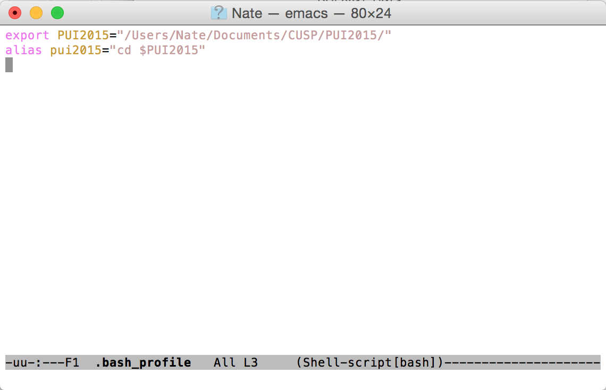

# PUI2015_nweber
I created an environmental variable PUI2015 that points to the directory /Users/Nate/Documents/CUSP/PUI2015/ - I also created an alias that changes to the directory above by typing pui2015
This makes changing to the PUI2015 directory easy

